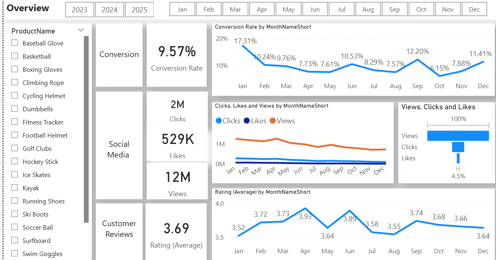

# 📊 Market Analysis Using SQL & Power BI  

**"Turning raw market data into actionable business insights."**  
This project showcases my ability to clean, transform, and analyze large datasets using SQL, and present findings through an interactive Power BI dashboard. The analysis helps identify sales trends, customer behavior patterns, and regional performance — empowering businesses to make data-driven decisions that improve revenue and customer engagement.  

## 📌 Project Overview  
This project focuses on analyzing market data to uncover customer behavior patterns, product performance, and regional sales trends. Using **SQL** for data cleaning, transformation, and advanced querying, and **Power BI** for interactive dashboard creation, the analysis provides actionable business insights to improve sales, marketing strategies, and customer engagement.

## 🛠 Tools & Technologies  
- **SQL** – Data extraction, cleaning, transformation, and analysis.  
- **Power BI** – Interactive dashboard and visualization.  
- **Excel/CSV** – Raw data storage.  

## 🔍 Key Steps in the Project  
1. **Data Cleaning in SQL**  
   - Removed duplicates using **CTEs** and `ROW_NUMBER()`.  
   - Standardized text formats (`UPPER()`, `REPLACE()` functions).  
   - Categorized products into **Low**, **Medium**, and **High** price ranges.  
   - Cleaned engagement data by fixing inconsistent naming and formatting dates.  
   - Enriched customer data by joining with **geography** details.  

2. **Data Analysis**  
   - Identified top-performing and underperforming products.  
   - Analyzed customer journey stages and actions.  
   - Measured engagement metrics like clicks, likes, and reviews.  
   - Segmented customers by demographics, location, and behavior.  

3. **Dashboard in Power BI**  
   - Visualized **top and bottom customers** for targeted offers.  
   - Compared **state-wise sales performance** to optimize supply chain.  
   - Monitored **marketing campaign engagement**.  
   - Filter options for dynamic analysis.  

## 📈 Key Insights  
- **Top customers** can be incentivized with loyalty programs to boost sales.  
- **Bottom customers** need re-engagement strategies.  
- **Top-performing states** indicate high-demand regions for better inventory planning.  
- **Low-performing states** reveal market penetration opportunities.  
- **Medium-priced products** have the highest sales volume, indicating a sweet spot for pricing strategy.  

## 📷 Dashboard Preview  

**Overview**  
  

**Conversion Rate Analysis**  
  

**Social Media Engagement**  
  
 

